# Rock, Paper, Scissors, Lizard, Spock

Rock, Paper, Scissors, Lizard, Spock is an entertainment website. The primary goal of this website to to host games for users; allowing them to have fun and spend time interacting with the website.

(Developed by: Stuart Wall)

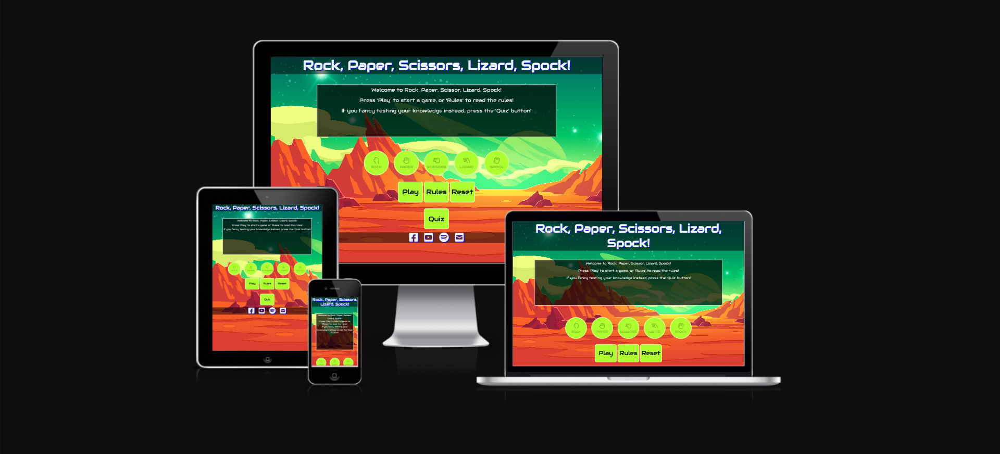

[Live Website](https://clinelly.github.io/CI_PP2_Rock_Paper_Scissors/)

## Table of Content

1. [Project Goals](#project-goals)
    1. [User Goals](#user-goals)
    2. [Site Owner Goals](#site-owner-goals)
2. [User Experience](#user-experience)
    1. [Target Audience](#target-audience)
    2. [User Requrements and Expectations](#user-requrements-and-expectations)
    3. [User Stories](#user-stories)
3. [Design](#design)
    1. [Design Choices](#design-choices)
    2. [Colour](#colours)
    3. [Fonts](#fonts)
    4. [Structure](#structure)
    5. [Wireframes](#wireframes)
4. [Technologies Used](#technologies-used)
    1. [Languages](#languages)
    2. [Frameworks & Tools](#frameworks-&-tools)
5. [Features](#features)
6. [Testing](#validation)
    1. [HTML Validation](#HTML-validation)
    2. [CSS Validation](#CSS-validation)
    3. [JS Validation](#JS-validation)
    4. [Accessibility](#accessibility)
    5. [Performance](#performance)
    6. [Device testing](#performing-tests-on-various-devices)
    7. [Browser compatibility](#browser-compatability)
    8. [Testing user stories](#testing-user-stories)
8. [Bugs](#Bugs)
9. [Deployment](#deployment)
10. [Credits](#credits)
11. [Acknowledgements](#acknowledgements)

## Project Goals
The overall project goal is to create a fun and interactive entertainment website where people can play games and pass the time.

### User Goals
- To play games.
- Enjoy media content.
- To learn new rules.
- To take a break/relax.

### Site Owner Goals
- Host a fun website.
- Enable users to play a game.
- Allow users to take a quiz.
- Pass on game knowledge.

## User Experience

### Target Audience 
- Younger users who like playing games.
- Users who are looking for a fun website to pass time on during a break.
- Older users who are learning about website functionality.

### User Requrements and Expectations

### User Stories

#### First Time Users 
 - To easily understand website function and purpose.
 - To easily navigate the website to find content.
 - To play a game of chance (Rock, Paper, Scissors, Lizard, Spock).
 - To take part in a quiz.

#### Returning Users 
 - Continue to play the game.
 - To have another attempt at the quiz.
 - Beat previous results.

#### Frequent User
- Check for any new features.
- Provide feedback and suggestions to the website host.

## Design

### Design Choices
I wanted the website to have a fun, science fiction theme; leaning on inspiration from the comedy show 'The Big Bang Theory' which popularised the game 'Rock, Paper, Scissors, Lizard, Spock' and the series 'Star Trek'; which introduced the world to the character of Spock.

### Colour
The colour scheme of the website ties into the sci-fi asthetic. The main background features an exotic alien planet and space-scape. The buttons are a luminous, alien green with a white border to draw attention to them. The content boxes are stylised like a retro sci-fi computer monitor; white text over a black box. The black is opaque to allow the user to see through to the background like a hologram. The title and media links have white text and a blue shadow, as a throwback to retro science-fictions tv shows.

### Fonts
The Audiowide font was used as the only font for the site. It is a soft font which is easy on the eyes and fits with the technological asthetic of the website. Sans Serif was used as the back-up font.

### Structure

The website uses a generic layout. This prevents users from having a frustrating experience, caused by having a complex or unfamiliar layout. The header shows the page title. The main content is displayed in the main body in the centre of the screen with interactive buttons allowing the users to navigate the site. The footer is located at the bottom of the webpage and contains direct links to related external media.

The website has three pages:
- The Home page, which houses the 'Rock, Paper, Scissors, Lizard, Spock' game.
- The Quiz page, which is where the quiz element of the site is located.
- The Form page, which allows the user to provide feedback and suggestions to the site creator.

### Wireframes

## Technologies Used

### Languages

- HTML 
- CSS
- JavaScript

### Frameworks & Tools

- Git
- GitHub
- GitPod
- Balsamiq
- Google Fonts
- Font Awesome
- Favicon.io
- Google Chrome Developer Tools
- emailJS

## Features

This website consists of 3 pages and 10 features.

### Existing Features

**Header**
Contains the title of the website for the user.

**Text Box**
Contains the game introduction for the user to read. The content will change when the user clicks various buttons.
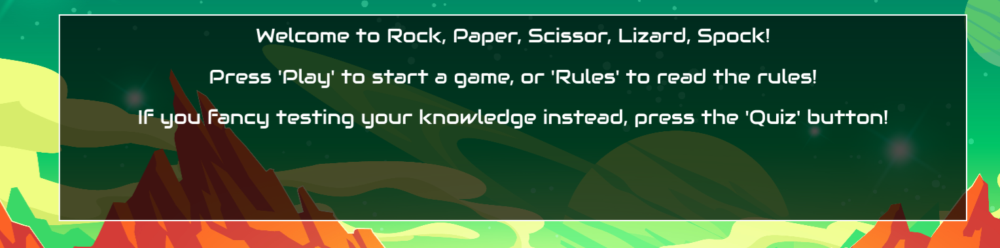

**Game Buttons**
The buttons the user will use to input their choice for the 'Rock, Paper, Scissors, Lizard, Spock' game. They are disabled until the user starts the game.
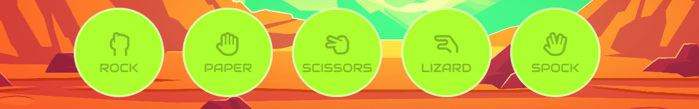
 
 **Control Buttons**
 The buttons the user will use to navigate the game system. The 'Play' button starts the game. the 'Rules' display the rules. The 'Reset' button resets the page. The 'Quiz' button will take the user to the quiz page.
 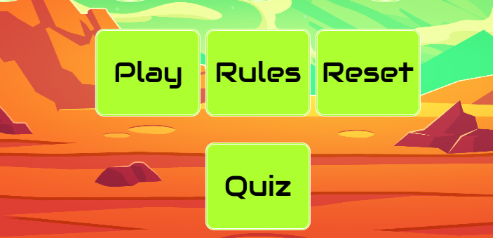

 **Footer**
 The Footer contains links to external media sites. The 'Facebook' logo takes the user to a related Facebook page. The 'Youtube' icon take the user to a Youtube video of the rules. The 'Spotify' logo takes the user to a funny song on Spotify. The Envelope take the user to the feedback form page.
 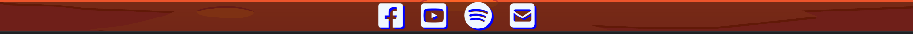

 **Quiz Intro**
 A small text box and start button to guide the user into starting the quiz.
 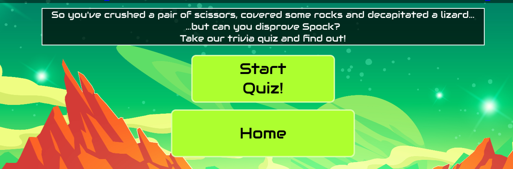

 **Quiz Questions**
 A text box which displays the questions and answer options to the user. A progress bar fills up with each question answered.
 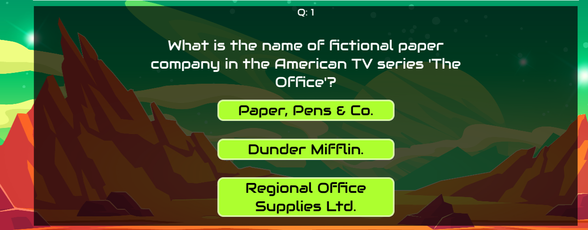

 **Feedback Form**
 A form which allows the user to contact the site creator with ideas and feedback. The form is linked to an email address via emailJS; which generates an email response when the form is filled in.
 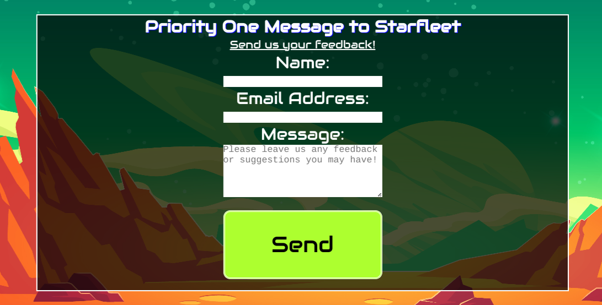

 **Feedback Response**
 A thank you message which pops up after the user has submitted the form.
 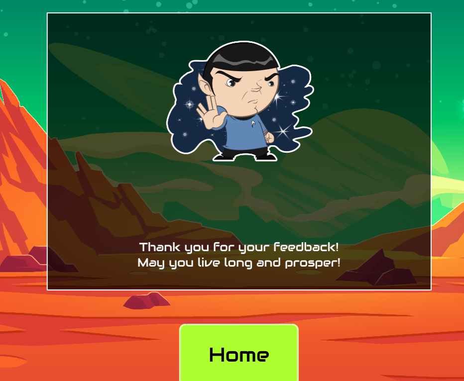

 **404 Page**
 An error page which displays if the user tries to naviate to an invalid page on the website. It contains an error image and message, as well as a button to return to the home page.
 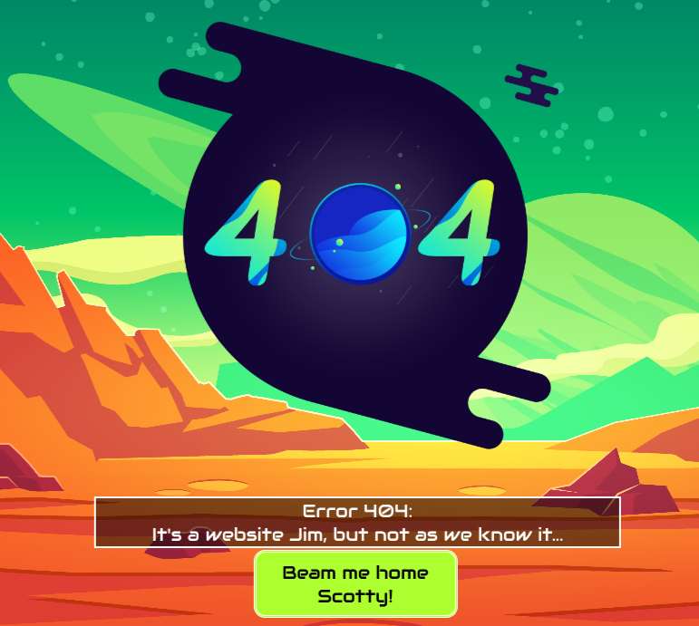

### Features to be Implemented

## Testing

### HTML Validation

The W3C Markup Validation Service was used to check the validity of the HTML used across the website. 

Home

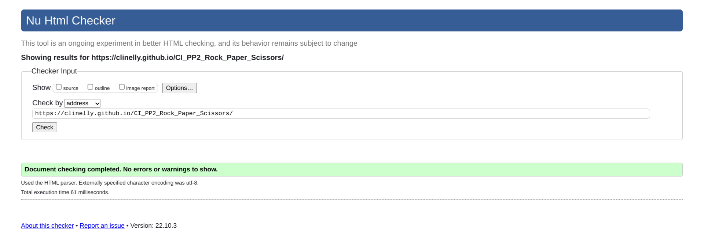

Quiz

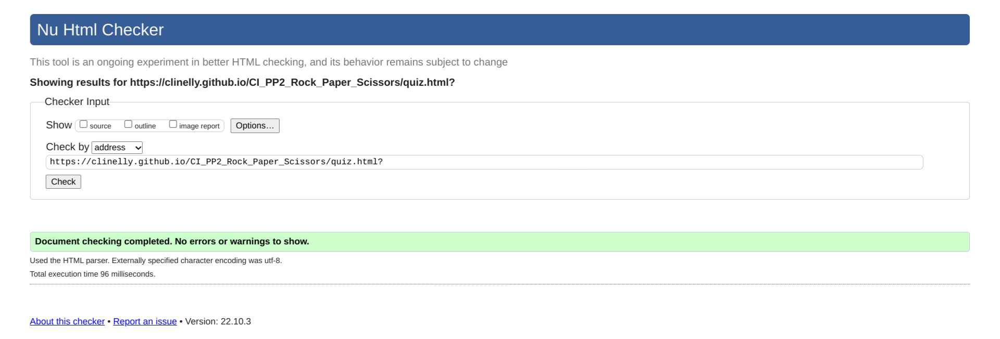

Form

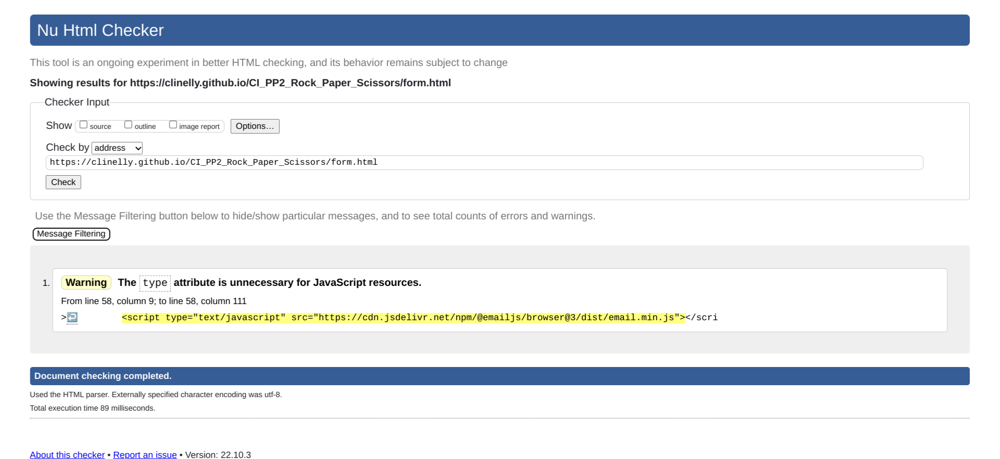

One warning was flagged on the form page (form.html). This is due to the link to the emailJS functionality script that was copied and pasted from the emailJS website.

### CSS Validation

The W3C CSS Validation tool was used to check the validity of the CSS code used for the website. No errors or warnings were returned.

Style

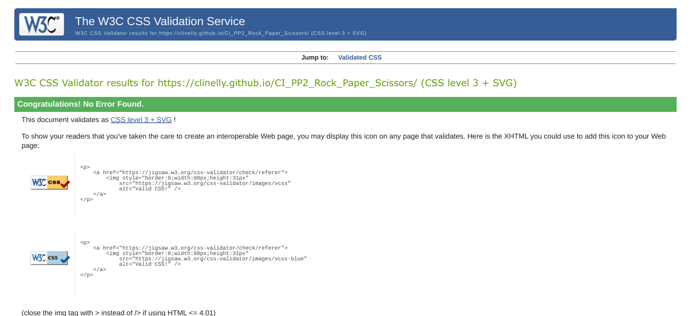

### JS Validation
JSHint was used to check validity of the JavaScript code used for the website.

Game

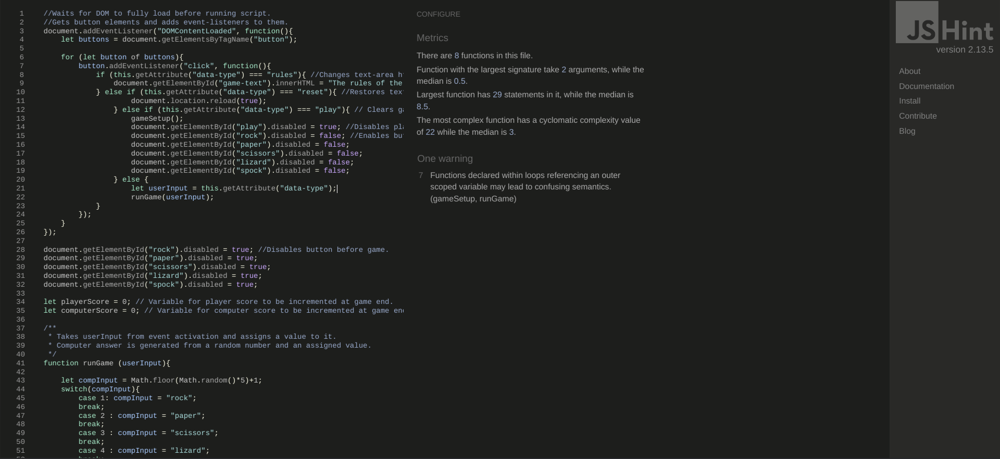
One warning was flagged with reference to functions taking values from higher scoped variables. This is because these variables are taken from user input in event listeners in order to set the game up and run the game itself.

Quiz

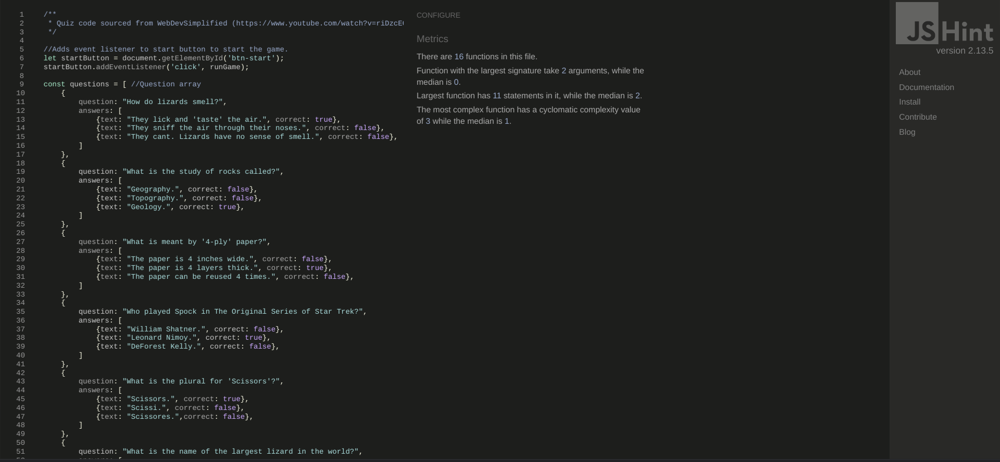

Form

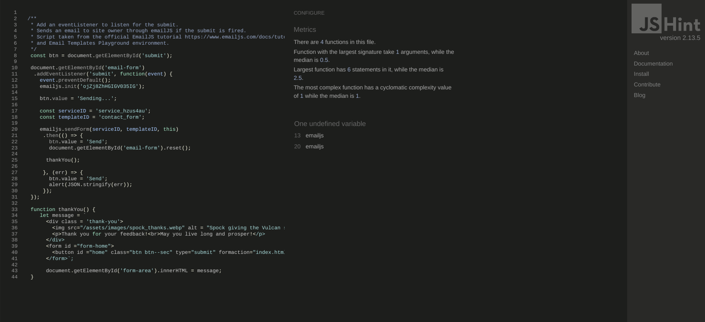

Two undeclared variables were flagged in the Form script (form.js). The code for the form was copied from the emailJS website.

### Accessibility

The WAVE WebAIM accessibility tool was used to evaluate the website's accessibility.

### Performance

Google Lighthouse in Google Chrome Developer Tools was used to test the performance of the website. 

### Device testing

The website was tested on the following devices:
- Google Pixel 6
- iPhone 11 Pro
- Acer Chromebook 314

### Browser compatibility

The website was tested on the following broswers:
- Microsoft Edge
- Mozilla Firefox
- Google Chrome

### Testing user stories

| **Feature** | **Action** | **Expected Result** | **Actual Result** |
|-------------|------------|---------------------|-------------------|

## Bugs

### Bugs Fixed

| **Bug** | **Fix**|
|-------------|------------|
|The scores for the Rock, Paper, Scissors game was resetting instead of incrementing. | Removed score variables from the function scope and declared it in the global scope.|
|The Rock, Paper, Scissors game can still be played after the winner has been declared. | Added a disable feature to the end game function to stop the user buttons from working.|
|The Home button on the feedback form does not work, citing required fields are not completed.| Removed home button from the main form and nested in a seperate form.|
|The style for the quiz buttons and container div did not align as expected. | Changed the div ID for the container div as it had the same ID as a container div for the Rock, Paper, Scissors game.|
|EmailJS Script was not generating a response email. | Reset EmailJS account and input new service_id and email template.|

### Bugs to be Fixed

## Deployment

The following steps were used to deploy the website using GitHub Pages:

- In the GitHub repository, navigate to the 'Settings' tab.
- On the left hand menu select 'Pages'.
- For the source, select 'Branch: Master'.
- The webpage will refresh automatically. A banner will display: "Your site is published at: https://clinelly.github.io/CI_PP2_Rock_Paper_Scissors/".
- After a few minutes, the live website will build and deploy.

In order to fork the repository, you must:

- Go to the GitHub repository.
- Click on 'Fork' button in upper right hand corner.
- Select 'Create new fork' from the drop-down menu.

You can clone the repository by:

- Going to the GitHub repository.
- Clicking the 'Code' button, loacted above the file list.
- Selecting if you prefer to clone using either HTTPS, SSH, or Github CLI.
- Clicking the copy button to copy the URL to your clipboard.
- Opening Git Bash.
- Changing the current working directory to one where you want to clone the directory to.
- Typing 'git clone' and pasting the URL from the clipboard ($ git clone https://github.com/YOUR-USERNAME/YOUR-REPOSITORY)
- Pressing 'Enter' to create your local clone.

The live link can be found here - https://clinelly.github.io/CI_PP2_Rock_Paper_Scissors/
The repository can be found here - https://github.com/Clinelly/CI_PP2_Rock_Paper_Scissors

## Credits

### Content
- Fix 401 error https://medium.com/@aurelien.delogu/401-error-on-a-webmanifest-file-cb9e3678b9f3
- Disable button https://www.includehelp.com/code-snippets/javascript-disable-button-after-click-using-function.aspx
- Progress bar: https://javascript.plainenglish.io/building-a-progress-bar-in-css-js-html-from-scratch-6449da06042
- Quiz: https://www.youtube.com/watch?v=riDzcEQbX6k

### Media
- Game Background: <a href="https://www.freepik.com/free-vector/mars-landscape-alien-planet-martian-background_7743415.htm#query=desert%20background&position=7&from_view=keyword">Image by upklyak</a> on Freepik

**404 Page**
- 404 image: <a href="https://lovepik.com/images/png-404.html">404 Png vectors by Lovepik.com</a>

**Form Page**
- Spock Image <a href="https://www.pngwing.com/en/free-png-yummm">by PngWing.com</a>

## Acknowledgements
- My mentor, Mo Shami, for pushing me and giving me great advice.
- My beautiful wife, Megan, for her continued love and support.
- Jim, Sawyer, and the other fantasic members of Code Institute's community team.
- The great people of class June '22 for their ideas and humour.